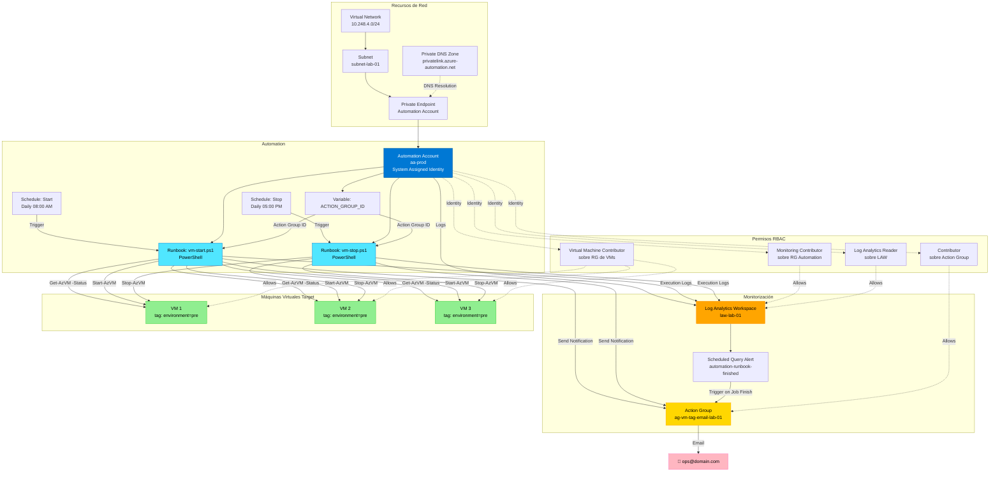
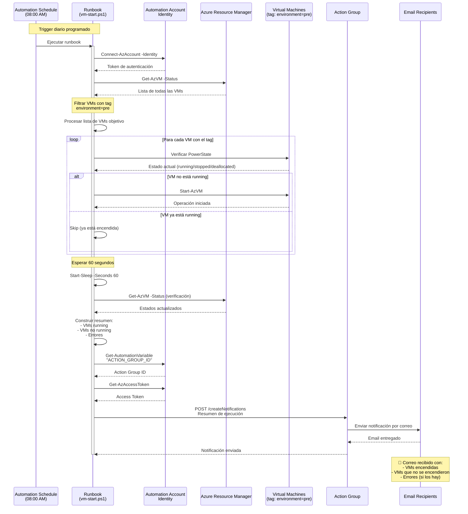
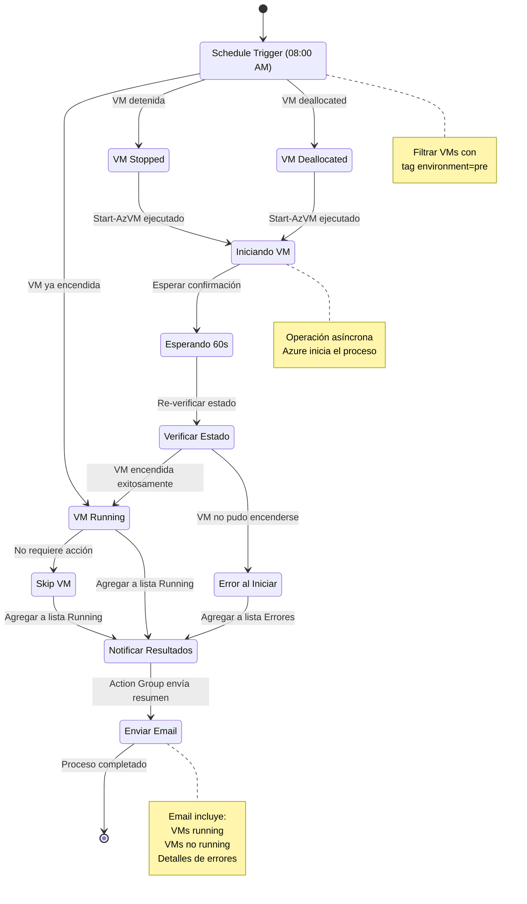

# Start/Stop VM Alarm

Solución de automatización en Azure para gestionar el encendido y apagado programado de máquinas virtuales basándose en etiquetas (tags), con notificaciones automáticas por correo electrónico sobre el estado de las operaciones.

## Descripción.

Este proyecto implementa una infraestructura completa en Azure usando Terraform que permite:

- **Automatizar el encendido/apagado** de VMs según horarios definidos
- **Filtrar VMs por tags** (por ejemplo, `environment=pre`)
- **Enviar notificaciones por correo** con el resultado de cada operación
- **Monitorizar** la ejecución de los runbooks mediante Log Analytics y alertas programadas
- **Desplegar con red privada** usando Private Endpoints para mayor seguridad

## Arquitectura

La solución despliega los siguientes componentes de Azure:

- **Automation Account** con identidad administrada (System Assigned)
- **Automation Runbooks** PowerShell para start/stop de VMs
- **Automation Schedules** para ejecutar runbooks de forma programada
- **Action Group** para notificaciones por correo electrónico
- **Log Analytics Workspace** para centralizar logs
- **Monitor Scheduled Query Rules Alert V2** para detectar finalización de jobs
- **Virtual Network** y **Subnet** para conectividad privada
- **Private DNS Zone** para resolución DNS privada del Automation Account
- **Role Assignments** necesarios para permisos de la identidad administrada

### Diagrama de Arquitectura



### Diagrama de Flujo de Ejecución



### Diagrama de Estados de VM



## Requisitos Previos

- **Terraform** >= 1.0
- **Azure CLI** configurado con permisos adecuados
- **Proveedor azurerm** 4.57.0
- Una **suscripción de Azure** activa
- Permisos para crear recursos en la suscripción

## Variables Principales

### Resource Group
```hcl
rg = {
  rg1 = {
    resource_group_name = "rg-lab-01"
    location            = "spaincentral"
  }
}
```

### Automation Account
```hcl
automation_accounts = {
  aa-prod = {
    automation_account_name       = "aa-prod"
    resource_group_name           = "rg-lab-01"
    location                      = "spaincentral"
    sku_name                      = "Basic"
    identity_type                 = "SystemAssigned"
    public_network_access_enabled = false
    private_dns_zone_ids          = "privatelink.azure-automation.net"
    subnet                        = "subnet-lab-01"
  }
}
```

### Automation Runbooks
```hcl
automation_runbooks = {
  rb_vm_start = {
    resource_group_name     = "rg-lab-01"
    location                = "spaincentral"
    automation_account_name = "aa-prod"
    runbook_type            = "PowerShell"
    script_path             = "runbooks/vm-start.ps1"
    description             = "Arranque de VMs"
  }
  rb_vm_stop = {
    resource_group_name     = "rg-lab-01"
    location                = "spaincentral"
    automation_account_name = "aa-prod"
    runbook_type            = "PowerShell"
    script_path             = "runbooks/vm-stop.ps1"
    description             = "Parada de VMs"
  }
}
```

### Automation Schedules
```hcl
automation_schedule = {
  sch_vm_start_pre_0800 = {
    name                    = "sch-vm-start-daily-0800"
    resource_group_name     = "rg-lab-01"
    automation_account_name = "aa-prod"
    frequency               = "Day"
    interval                = 1
    vm_start_schedule_start_time  = "2026-01-15T08:00:00+01:00"
    vm_start_schedule_timezone    = "Europe/Madrid"
    runbook_name            = "rb_vm_start"
    tag_key                 = "environment"
    tag_value               = "pre"
  }
}
```

### Role Assignments
```hcl
role_assignments = {
  ra1 = {
    scope                   = "/subscriptions/{sub-id}/resourceGroups/rg-vms"
    role_definition_name    = "Virtual Machine Contributor"
    automation_account_name = "aa-prod"
  }
  ra2 = {
    scope                   = "/subscriptions/{sub-id}/resourceGroups/rg-lab-01"
    role_definition_name    = "Monitoring Contributor"
    automation_account_name = "aa-prod"
  }
  ra3 = {
    scope                   = "/subscriptions/{sub-id}/resourceGroups/rg-lab-01/providers/Microsoft.Insights/actionGroups/ag-vm-tag-email-lab-01"
    role_definition_name    = "Contributor"
    automation_account_name = "aa-prod"
  }
  ra_law_reader = {
    scope                   = "/subscriptions/{sub-id}/resourceGroups/rg-lab-01/providers/Microsoft.OperationalInsights/workspaces/law-lab-01"
    role_definition_name    = "Log Analytics Reader"
    automation_account_name = "aa-prod"
  }
}
```

### Monitor Action Group
```hcl
monitor_action_group = {
  ag_lab_email = {
    name                            = "ag-vm-tag-email-lab-01"
    resource_group_name             = "rg-lab-01"
    short_name                      = "aglabemail"
    email_receiver_name             = "ops"
    email_receiver_email_address    = "usuario@dominio.com"
    automation_account_name         = "aa-prod"
  }
}
```

### Log Analytics
```hcl
log_analytics = {
  log1 = {
    name                    = "law-lab-01"
    location                = "spaincentral"
    resource_group_name     = "rg-lab-01"
    sku                     = "PerGB2018"
    retention_in_days       = "30"
    automation_account_name = "aa-prod"
  }
}
```

### Monitor Scheduled Query Rules Alert
```hcl
monitor_scheduled_query_rules_alert_v2 = {
  alert_automation_job_finished = {
    name                                        = "automation-runbook-finished"
    resource_group_name                         = "rg-lab-01"
    location                                    = "spaincentral"
    law_id                                      = "law-lab-01"
    severity                                    = 4
    evaluation_frequency                        = "PT5M"
    window_duration                             = "PT5M"
    time_aggregation_method                     = "Count"
    operator                                    = "GreaterThan"
    threshold                                   = 0
    minimum_failing_periods_to_trigger_alert    = 1
    number_of_evaluation_periods                = 1
    action_group_id                             = "ag_lab_email"
  }
}
```

## Instalación y Uso

### 1. Clonar el repositorio
```bash
git clone https://github.com/luisadanmunoz/start-stop-VM-alarm.git
cd start-stop-VM-alarm
```

### 2. Configurar variables
Copia el archivo de ejemplo y ajusta los valores según tu entorno:

```bash
cp start-stop-VM-alarm.tfvars.example terraform.tfvars
```

Edita `terraform.tfvars` y configura:
- IDs de recursos (scopes) para role assignments
- Direcciones de correo electrónico para notificaciones
- Horarios de inicio/parada (en formato ISO8601)
- Tags para filtrar las VMs

### 3. Configurar backend (opcional)
Si usas un backend remoto en Azure Storage, configura el archivo `backend.conf`:

```hcl
resource_group_name  = "rg-terraform-state"
storage_account_name = "sttfstate"
container_name       = "tfstate"
key                  = "start-stop-vm.tfstate"
```

### 4. Inicializar Terraform
```bash
terraform init -backend-config=backend.conf
```

### 5. Validar configuración
```bash
terraform validate
terraform plan
```

### 6. Desplegar infraestructura
```bash
terraform apply
```

### 7. Configurar variable en Automation Account
Después del despliegue, configura manualmente la variable `ACTION_GROUP_ID` en el Automation Account:

1. Ve al Automation Account en el portal de Azure
2. Navega a **Variables** en el menú lateral
3. Crea una nueva variable:
   - **Nombre**: `ACTION_GROUP_ID`
   - **Valor**: `/subscriptions/{sub-id}/resourceGroups/{rg-name}/providers/Microsoft.Insights/actionGroups/{ag-name}`
   - **Tipo**: String
   - **Encriptada**: No

## Estructura de Archivos

```
.
├── automation_account.tf                     # Automation Account principal
├── automation_runbook.tf                     # Runbooks PowerShell
├── automation_schedule.tf                    # Programación de runbooks
├── log_analytics.tf                          # Log Analytics Workspace
├── monitor_action_group.tf                   # Action Group para emails
├── monitor_scheduled_query_rules_alert_v2.tf # Alertas de monitorización
├── private_dns_zone.tf                       # DNS privado
├── provider.tf                               # Providers y backend
├── rg.tf                                     # Resource Groups
├── role_assignment.tf                        # Asignaciones de roles
├── subnet.tf                                 # Subnets
├── variables.tf                              # Definición de variables
├── vnet.tf                                   # Virtual Networks
├── start-stop-VM-alarm.tfvars                # Valores de variables
├── runbooks/
│   ├── vm-start.ps1                          # Script PowerShell para iniciar VMs
│   └── vm-stop.ps1                           # Script PowerShell para detener VMs
└── README.md                                 # Este archivo
```

## Funcionamiento de los Runbooks

### vm-start.ps1
Runbook PowerShell que realiza las siguientes acciones:

1. Se conecta a Azure usando la identidad administrada del Automation Account
2. Busca todas las VMs que tengan un tag específico (por ejemplo, `environment=pre`)
3. Verifica el estado actual de cada VM
4. Intenta iniciar las VMs que estén detenidas
5. Espera 60 segundos para permitir que las VMs se inicien
6. Vuelve a verificar el estado de todas las VMs
7. Envía un correo electrónico mediante el Action Group con un resumen detallado:
   - VMs que quedaron en estado "Running"
   - VMs que no lograron iniciarse (con su estado actual)
   - Errores encontrados durante el proceso

**Parámetros del runbook:**
- `tagkey`: Clave del tag para filtrar VMs (default: "environment")
- `tagvalue`: Valor del tag para filtrar VMs (default: "pre")
- `subscriptionid`: ID de suscripción (opcional, usa la del contexto si no se especifica)
- `waitseconds`: Segundos a esperar antes del re-chequeo (default: 60)

### vm-stop.ps1
Runbook similar a vm-start.ps1 pero para detener VMs. Sigue el mismo flujo de trabajo pero ejecuta `Stop-AzVM` en lugar de `Start-AzVM`.

### Ejemplo de correo de notificación
```
Asunto: Resultado start VMs por tag (environment=pre)

Resumen:
- Running: vm-web-01, vm-app-01, vm-db-01
- No running: vm-test-01 [VM deallocated]
- Errores al solicitar start: (ninguno)
```

## Permisos Necesarios

La identidad administrada del Automation Account requiere los siguientes roles:

| Rol | Ámbito | Propósito |
|-----|--------|-----------|
| Virtual Machine Contributor | Resource Group de las VMs | Iniciar/detener VMs |
| Monitoring Contributor | Resource Group del Automation Account | Escribir logs y métricas |
| Contributor | Action Group específico | Enviar notificaciones |
| Log Analytics Reader | Log Analytics Workspace | Leer logs para alertas |

## Características de Seguridad

- **Red privada**: El Automation Account está configurado con `public_network_access_enabled = false`
- **Private Endpoint**: Acceso al Automation Account mediante Private Endpoint
- **Private DNS Zone**: Resolución DNS privada para `privatelink.azure-automation.net`
- **Identidad administrada**: Usa System Assigned Managed Identity sin necesidad de credenciales
- **Principio de mínimo privilegio**: Los role assignments están limitados a los ámbitos necesarios

## Monitorización y Alertas

### Log Analytics
Todos los logs de ejecución de los runbooks se envían automáticamente al Log Analytics Workspace configurado.

### Alertas Programadas
Se configura una alerta que se ejecuta cada 5 minutos para detectar cuando un runbook finaliza su ejecución. Esto permite:

- Detectar fallos en la ejecución
- Monitorizar tiempos de ejecución
- Tener visibilidad del estado general del sistema

### Notificaciones por Email
Cada ejecución de runbook envía un correo electrónico con:

- Estado final de cada VM objetivo
- Lista de VMs que se iniciaron/detuvieron correctamente
- Lista de VMs que no cambiaron de estado
- Detalles de errores si los hubiera

## Ejemplo de Uso

### Configurar inicio automático diario
Para configurar que las VMs con tag `environment=pre` se inicien todos los días a las 8:00 AM:

```hcl
automation_schedule = {
  sch_vm_start_pre_0800 = {
    name                              = "sch-vm-start-daily-0800"
    resource_group_name               = "rg-lab-01"
    automation_account_name           = "aa-prod"
    frequency                         = "Day"
    interval                          = 1
    vm_start_schedule_start_time      = "2026-01-15T08:00:00+01:00"
    vm_start_schedule_description     = "Arranca VMs con tag environment=pre"
    vm_start_schedule_timezone        = "Europe/Madrid"
    runbook_name                      = "rb_vm_start"
    tag_key                           = "environment"
    tag_value                         = "pre"
  }
}
```

### Configurar parada automática diaria
Para configurar que las mismas VMs se detengan todos los días a las 17:00 PM:

```hcl
automation_schedule = {
  sch_vm_stop_pre_1700 = {
    name                              = "sch-vm-stop-daily-1700"
    resource_group_name               = "rg-lab-01"
    automation_account_name           = "aa-prod"
    frequency                         = "Day"
    interval                          = 1
    vm_start_schedule_start_time      = "2026-01-15T17:00:00+01:00"
    vm_start_schedule_description     = "Para VMs con tag environment=pre"
    vm_start_schedule_timezone        = "Europe/Madrid"
    runbook_name                      = "rb_vm_stop"
    tag_key                           = "environment"
    tag_value                         = "pre"
  }
}
```

### Etiquetar VMs para automatización
Para que una VM sea gestionada por esta solución, simplemente añádele el tag correspondiente:

```bash
az vm update \
  --resource-group rg-vms-prod \
  --name vm-web-01 \
  --set tags.environment=pre
```

O mediante Terraform:

```hcl
resource "azurerm_virtual_machine" "example" {
  name                = "vm-web-01"
  resource_group_name = "rg-vms-prod"
  location            = "spaincentral"
  # ... otras configuraciones ...
  
  tags = {
    environment = "pre"
  }
}
```

## Solución de Problemas

### Los runbooks no se ejecutan
1. Verifica que los schedules tengan una fecha de inicio futura
2. Confirma que el runbook está publicado (estado "Published")
3. Revisa los logs en el Log Analytics Workspace

### Las VMs no se inician/detienen
1. Verifica que la identidad administrada tenga los permisos necesarios
2. Confirma que las VMs tengan el tag correcto configurado
3. Revisa los logs de ejecución del runbook en el Automation Account

### No llegan notificaciones por correo
1. Verifica que la variable `ACTION_GROUP_ID` esté configurada correctamente
2. Confirma que el email en el Action Group sea correcto
3. Revisa la bandeja de spam
4. Verifica que la identidad tenga permisos de "Contributor" sobre el Action Group

### Error de conexión al Automation Account
1. Verifica que el Private Endpoint esté correctamente configurado
2. Confirma que la Private DNS Zone esté vinculada a la VNet correcta
3. Verifica la resolución DNS desde la red privada

## Costos Estimados

Costos mensuales aproximados (región Spain Central):

- Automation Account (Basic): ~€0
- Ejecuciones de runbook: ~€0.002 por minuto de ejecución
- Log Analytics Workspace (PerGB2018): desde €2.76/GB ingerido
- Action Group: Primeras 1000 notificaciones gratis, luego ~€0.60/1000 emails
- Private Endpoint: ~€6.57/mes
- Virtual Network: Gratis

**Estimación total**: €10-20/mes para uso básico (2 ejecuciones diarias)

## Mejoras Futuras

- [ ] Añadir soporte para múltiples suscripciones
- [ ] Implementar retry logic para VMs que no cambien de estado
- [ ] Añadir dashboard en Azure Monitor con métricas clave
- [ ] Implementar webhook para notificaciones a Teams/Slack
- [ ] Añadir runbook para start/stop bajo demanda
- [ ] Implementar start/stop basado en condiciones (uso de CPU, costo)

## Contribución

Las contribuciones son bienvenidas. Por favor:

1. Haz fork del repositorio
2. Crea una rama para tu feature (`git checkout -b feature/nueva-funcionalidad`)
3. Commitea tus cambios (`git commit -am 'Añadir nueva funcionalidad'`)
4. Push a la rama (`git push origin feature/nueva-funcionalidad`)
5. Crea un Pull Request

## Licencia

Este proyecto está bajo la licencia MIT. Ver el archivo `LICENSE` para más detalles.

## Autor

**Luis Adán Muñoz**
- GitHub: [@luisadanmunoz](https://github.com/luisadanmunoz)

## Agradecimientos

- Documentación oficial de Azure Automation
- Comunidad de Terraform
- Equipo de Azure

## Referencias

- [Azure Automation Documentation](https://docs.microsoft.com/en-us/azure/automation/)
- [Terraform AzureRM Provider](https://registry.terraform.io/providers/hashicorp/azurerm/latest/docs)
- [Azure Monitor Action Groups](https://docs.microsoft.com/en-us/azure/azure-monitor/alerts/action-groups)
- [Log Analytics Workspaces](https://docs.microsoft.com/en-us/azure/azure-monitor/logs/log-analytics-workspace-overview)