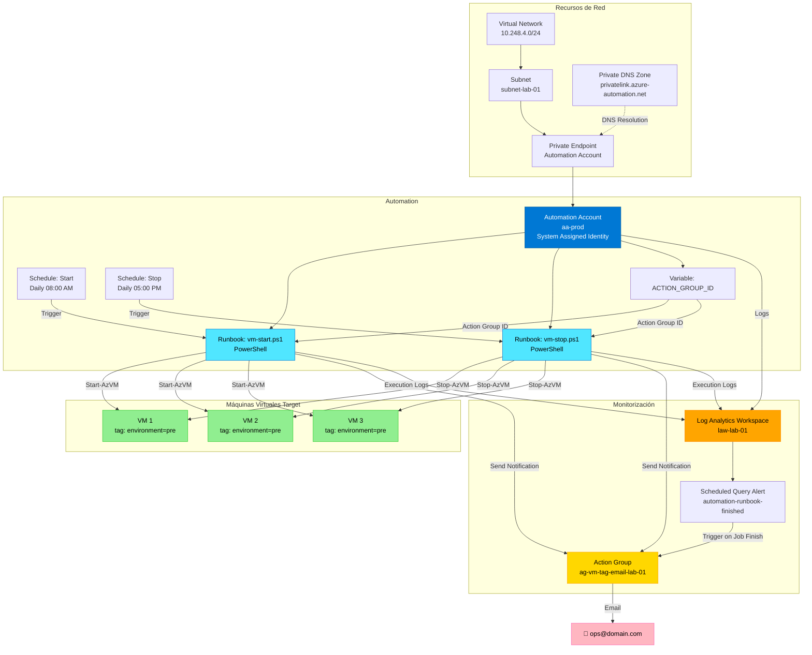
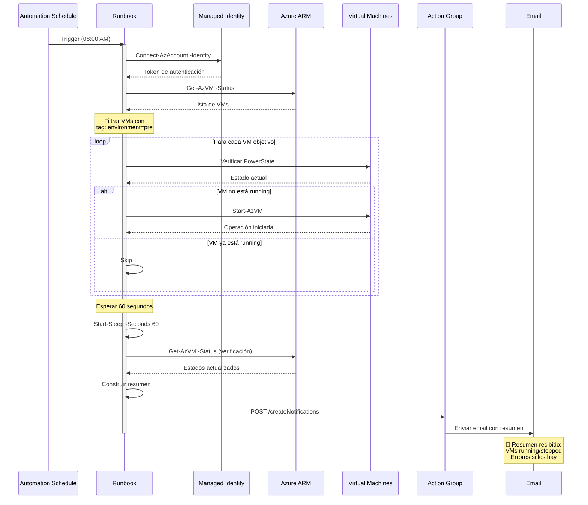

# Automatización Inteligente de VMs en Azure: Start/Stop con Terraform y Notificaciones

¿Te has preguntado cuánto dinero estás desperdiciando por dejar VMs de desarrollo o testing encendidas durante las noches y fines de semana? En este artículo te mostraré cómo implementé una solución completa de automatización en Azure que no solo gestiona el ciclo de vida de tus VMs, sino que también te mantiene informado de cada operación mediante notificaciones inteligentes.

## El Problema: VMs Olvidadas = Dinero Desperdiciado

En entornos de desarrollo y preproducción, es común que los equipos dejen las máquinas virtuales encendidas 24/7 "por si acaso". Sin embargo, esto genera costos innecesarios:

- Una VM B2s en Azure cuesta aproximadamente **€30/mes** si se ejecuta continuamente
- Si solo necesitas esa VM 8 horas al día (de lunes a viernes), podrías estar pagando **3x más** de lo necesario
- Multiplica esto por 10, 20 o 50 VMs en tu organización... ¡los números se disparan!

**La solución**: Automatizar el encendido y apagado de VMs basándose en horarios y etiquetas.

## La Solución: Infraestructura como Código con Terraform

He desarrollado una solución completa usando Terraform que implementa:

✅ **Azure Automation Account** con identidad administrada  
✅ **Runbooks PowerShell** para iniciar/detener VMs  
✅ **Schedules automatizados** para ejecución programada  
✅ **Filtrado por tags** para gestión granular  
✅ **Notificaciones por email** con resumen de operaciones  
✅ **Monitorización** con Log Analytics y alertas  
✅ **Conectividad privada** mediante Private Endpoints  

## Arquitectura de la Solución

La arquitectura se compone de varios componentes de Azure trabajando en conjunto:



### Componentes Principales

#### 1. **Automation Account**
El cerebro de la operación. Configurado con:
- **Identidad Administrada (System Assigned)**: No requiere credenciales explícitas
- **Conectividad Privada**: Mediante Private Endpoint para mayor seguridad
- **SKU Basic**: Suficiente para la mayoría de casos de uso

#### 2. **Runbooks PowerShell**
Scripts que ejecutan la lógica de negocio:
- `vm-start.ps1`: Enciende VMs filtradas por tags
- `vm-stop.ps1`: Apaga VMs filtradas por tags

Cada runbook sigue este flujo:



#### 3. **Schedules Automatizados**
Programaciones que disparan los runbooks:
- **Inicio**: Lunes a Viernes, 08:00 AM
- **Parada**: Lunes a Viernes, 05:00 PM
- **Zona horaria**: Europe/Madrid (configurable)

#### 4. **Action Groups y Notificaciones**
Sistema de notificaciones que envía emails con:
- Lista de VMs que se iniciaron correctamente
- Lista de VMs que no pudieron iniciarse
- Detalles de errores encontrados
- Estado final de cada VM

## Implementación Paso a Paso

### Paso 1: Preparar el Entorno

Clona el repositorio:

```bash
git clone https://github.com/luisadanmunoz/start-stop-VM-alarm.git
cd start-stop-VM-alarm
```

### Paso 2: Configurar Variables

Crea tu archivo `terraform.tfvars` basándote en el ejemplo:

```hcl
# Tags para identificar recursos
tags = {
  environment = "lab"
  project     = "vm-automation"
}

# Resource Group
rg = {
  rg1 = {
    resource_group_name = "rg-automation-lab"
    location            = "spaincentral"
  }
}

# Automation Account
automation_accounts = {
  aa-prod = {
    automation_account_name       = "aa-vm-automation"
    resource_group_name           = "rg-automation-lab"
    location                      = "spaincentral"
    sku_name                      = "Basic"
    identity_type                 = "SystemAssigned"
    public_network_access_enabled = false
    private_dns_zone_ids          = "privatelink.azure-automation.net"
    subnet                        = "subnet-automation"
  }
}

# Runbooks
automation_runbooks = {
  rb_vm_start = {
    resource_group_name     = "rg-automation-lab"
    location                = "spaincentral"
    automation_account_name = "aa-vm-automation"
    runbook_type            = "PowerShell"
    script_path             = "runbooks/vm-start.ps1"
    description             = "Arranque automático de VMs"
  }
  rb_vm_stop = {
    resource_group_name     = "rg-automation-lab"
    location                = "spaincentral"
    automation_account_name = "aa-vm-automation"
    runbook_type            = "PowerShell"
    script_path             = "runbooks/vm-stop.ps1"
    description             = "Parada automática de VMs"
  }
}

# Schedules
automation_schedule = {
  sch_vm_start_pre_0800 = {
    name                              = "sch-vm-start-daily-0800"
    resource_group_name               = "rg-automation-lab"
    automation_account_name           = "aa-vm-automation"
    frequency                         = "Day"
    interval                          = 1
    vm_start_schedule_start_time      = "2026-01-23T08:00:00+01:00"
    vm_start_schedule_description     = "Arranque automático VMs pre"
    vm_start_schedule_timezone        = "Europe/Madrid"
    runbook_name                      = "rb_vm_start"
    tag_key                           = "environment"
    tag_value                         = "pre"
  }
  sch_vm_stop_pre_1700 = {
    name                              = "sch-vm-stop-daily-1700"
    resource_group_name               = "rg-automation-lab"
    automation_account_name           = "aa-vm-automation"
    frequency                         = "Day"
    interval                          = 1
    vm_start_schedule_start_time      = "2026-01-23T17:00:00+01:00"
    vm_start_schedule_description     = "Parada automática VMs pre"
    vm_start_schedule_timezone        = "Europe/Madrid"
    runbook_name                      = "rb_vm_stop"
    tag_key                           = "environment"
    tag_value                         = "pre"
  }
}

# Action Group para notificaciones
monitor_action_group = {
  ag_lab_email = {
    name                            = "ag-vm-automation-email"
    resource_group_name             = "rg-automation-lab"
    short_name                      = "vmautoemail"
    email_receiver_name             = "ops-team"
    email_receiver_email_address    = "tu-email@dominio.com"
    automation_account_name         = "aa-vm-automation"
  }
}
```

### Paso 3: Configurar Role Assignments

**Importante**: Los permisos deben configurarse con los IDs reales de tus recursos:

```hcl
role_assignments = {
  # Permiso para gestionar VMs
  ra_vm_contributor = {
    scope                   = "/subscriptions/{sub-id}/resourceGroups/{rg-vms}"
    role_definition_name    = "Virtual Machine Contributor"
    automation_account_name = "aa-vm-automation"
  }
  
  # Permiso para monitorización
  ra_monitoring = {
    scope                   = "/subscriptions/{sub-id}/resourceGroups/rg-automation-lab"
    role_definition_name    = "Monitoring Contributor"
    automation_account_name = "aa-vm-automation"
  }
  
  # Permiso sobre Action Group
  ra_action_group = {
    scope                   = "/subscriptions/{sub-id}/resourceGroups/rg-automation-lab/providers/Microsoft.Insights/actionGroups/ag-vm-automation-email"
    role_definition_name    = "Contributor"
    automation_account_name = "aa-vm-automation"
  }
  
  # Permiso para leer Log Analytics
  ra_law_reader = {
    scope                   = "/subscriptions/{sub-id}/resourceGroups/rg-automation-lab/providers/Microsoft.OperationalInsights/workspaces/law-automation"
    role_definition_name    = "Log Analytics Reader"
    automation_account_name = "aa-vm-automation"
  }
}
```

### Paso 4: Desplegar con Terraform

```bash
# Inicializar Terraform
terraform init

# Validar configuración
terraform validate

# Ver plan de ejecución
terraform plan

# Aplicar cambios
terraform apply
```

### Paso 5: Configurar Variable en Automation Account

Después del despliegue, configura manualmente la variable `ACTION_GROUP_ID`:

```bash
# Obtener el ID del Action Group
ACTION_GROUP_ID=$(az monitor action-group show \
  --name ag-vm-automation-email \
  --resource-group rg-automation-lab \
  --query id -o tsv)

# Crear la variable en el Automation Account
az automation variable create \
  --automation-account-name aa-vm-automation \
  --resource-group rg-automation-lab \
  --name ACTION_GROUP_ID \
  --value "$ACTION_GROUP_ID"
```

O manualmente desde el portal de Azure:
1. Navega al Automation Account
2. Ve a **Variables** en el menú lateral
3. Crea variable `ACTION_GROUP_ID` con el resource ID del Action Group

### Paso 6: Etiquetar VMs

Para que una VM sea gestionada por la automatización, añádele el tag apropiado:

```bash
# Mediante Azure CLI
az vm update \
  --resource-group rg-vms-prod \
  --name vm-web-app-01 \
  --set tags.environment=pre

# Mediante Terraform
resource "azurerm_linux_virtual_machine" "web_app" {
  name                = "vm-web-app-01"
  resource_group_name = "rg-vms-prod"
  location            = "spaincentral"
  # ... otras configuraciones ...
  
  tags = {
    environment = "pre"
    managed_by  = "automation"
  }
}
```

## Detalles Técnicos de los Runbooks

### Script vm-start.ps1

El runbook de inicio implementa una lógica robusta:

```powershell
param(
  [string]$tagkey   = "environment",
  [string]$tagvalue = "pre",
  [string]$subscriptionid = "",
  [int]$waitseconds = 60
)

# 1. Autenticación con Managed Identity
Connect-AzAccount -Identity | Out-Null

# 2. Cambiar contexto si se especifica suscripción
if ($subscriptionid -and $subscriptionid.Trim().Length -gt 0) {
  Set-AzContext -Subscription $subscriptionid | Out-Null
}

# 3. Obtener VMs con el tag especificado
$vms = Get-AzVM -Status
$targets = $vms | Where-Object {
  $_.Tags.ContainsKey($tagkey) -and $_.Tags[$tagkey] -eq $tagvalue
}

# 4. Cargar Action Group ID
$actionGroupId = Get-AutomationVariable -Name "ACTION_GROUP_ID"
if (-not $actionGroupId) { 
  throw "No existe la variable ACTION_GROUP_ID" 
}

# 5. Si no hay VMs, notificar y salir
if (-not $targets -or $targets.Count -eq 0) {
  Send-ActionGroupMail `
    "AVISO: no hay VMs con tag ($tagkey=$tagvalue)" `
    "El runbook se ejecutó pero no encontró VMs."
  return
}

# 6. Intentar iniciar cada VM
$startErrors = @()
foreach ($vm in $targets) {
  $powerState = ($vm.Statuses | 
    Where-Object { $_.Code -like "PowerState/*" } | 
    Select-Object -First 1).DisplayStatus
  
  if ($powerState -eq "VM running") {
    Write-Output "  - VM $($vm.Name) ya está arrancada. Skip."
    continue
  }
  
  try {
    Start-AzVM -ResourceGroupName $vm.ResourceGroupName `
              -Name $vm.Name `
              -ErrorAction Stop | Out-Null
    Write-Output "  - VM $($vm.Name) iniciada correctamente"
  }
  catch {
    $startErrors += [PSCustomObject]@{ 
      name = $vm.Name
      error = $_.Exception.Message 
    }
  }
}

# 7. Esperar y re-verificar estados
Start-Sleep -Seconds $waitseconds

$after = Get-AzVM -Status | Where-Object {
  $_.Tags.ContainsKey($tagkey) -and $_.Tags[$tagkey] -eq $tagvalue
}

# 8. Clasificar resultados
$running = @()
$notRunning = @()

foreach ($vm in $after) {
  $ps = ($vm.Statuses | 
    Where-Object { $_.Code -like "PowerState/*" }).DisplayStatus
  
  if ($ps -eq "VM running") {
    $running += $vm.Name
  } else {
    $notRunning += "$($vm.Name) [$ps]"
  }
}

# 9. Enviar resumen por email
$subject = "Resultado start VMs por tag ($tagkey=$tagvalue)"
$desc = @"
Resumen:
- Running: $($running -join ", ")
- No running: $($notRunning -join ", ")
- Errores: $($startErrors | ForEach-Object { "$($_.name): $($_.error)" } -join " | ")
"@

Send-ActionGroupMail $subject $desc
```

### Características Destacadas

1. **Manejo de errores robusto**: Captura y reporta errores individuales sin detener el proceso
2. **Verificación post-inicio**: Espera 60 segundos y verifica que las VMs realmente se iniciaron
3. **Notificaciones detalladas**: Informa sobre éxitos, fallos y VMs que ya estaban encendidas
4. **Parámetros configurables**: Permite personalizar tags, suscripción y tiempo de espera
5. **Idempotencia**: Detecta VMs ya encendidas y las omite

## Ejemplo de Notificación por Email

Cuando el runbook se ejecuta, recibes un email como este:

```
De: Azure Action Group <no-reply@microsoft.com>
Para: ops-team@tudominio.com
Asunto: Resultado start VMs por tag (environment=pre)

Resumen de ejecución del runbook vm-start.ps1:

✅ VMs en estado Running:
   • vm-web-app-01
   • vm-api-backend-01
   • vm-database-01

⚠️ VMs que no se iniciaron:
   • vm-test-server-01 [VM deallocated]

❌ Errores encontrados:
   (ninguno)

Timestamp: 2026-01-22 08:01:23 UTC
Automation Account: aa-vm-automation
Runbook Job ID: 3f7a9c2b-4d8e-4f1a-9b6c-2e5d8f3a7c1b
```

## Monitorización con Log Analytics

Todos los logs se centralizan en Log Analytics Workspace. Puedes ejecutar queries KQL para analizar:

### Consultar ejecuciones recientes

```kql
AzureDiagnostics
| where ResourceProvider == "MICROSOFT.AUTOMATION"
| where Category == "JobLogs"
| where RunbookName_s in ("rb_vm_start", "rb_vm_stop")
| project TimeGenerated, RunbookName_s, ResultType, JobId_g
| order by TimeGenerated desc
| take 50
```

### Detectar fallos en runbooks

```kql
AzureDiagnostics
| where ResourceProvider == "MICROSOFT.AUTOMATION"
| where Category == "JobStreams"
| where ResultType == "Failed"
| project TimeGenerated, RunbookName_s, StreamType_s, ResultDescription
| order by TimeGenerated desc
```

### Analizar tiempo de ejecución

```kql
AzureDiagnostics
| where ResourceProvider == "MICROSOFT.AUTOMATION"
| where Category == "JobLogs"
| where ResultType == "Completed"
| extend Duration = datetime_diff('second', EndTime_t, CreationTime_t)
| summarize AvgDuration=avg(Duration), MaxDuration=max(Duration) 
    by RunbookName_s
```

## Alertas Automáticas

La solución incluye una alerta programada que se dispara cada vez que finaliza un job:

```hcl
monitor_scheduled_query_rules_alert_v2 = {
  alert_automation_job_finished = {
    name                     = "automation-runbook-finished"
    severity                 = 4  # Informational
    evaluation_frequency     = "PT5M"  # Cada 5 minutos
    window_duration          = "PT5M"
    time_aggregation_method  = "Count"
    operator                 = "GreaterThan"
    threshold                = 0
    
    # Query KQL
    query = <<-QUERY
      AzureDiagnostics
      | where ResourceProvider == "MICROSOFT.AUTOMATION"
      | where Category == "JobLogs"
      | where TimeGenerated > ago(5m)
      | where ResultType in ("Completed", "Failed", "Stopped")
    QUERY
  }
}
```

## Seguridad y Mejores Prácticas

### 1. **Principio de Mínimo Privilegio**

Los role assignments están limitados al ámbito mínimo necesario:

| Rol | Ámbito | Justificación |
|-----|--------|---------------|
| Virtual Machine Contributor | RG de VMs | Solo para start/stop, no para crear/eliminar |
| Monitoring Contributor | RG del Automation | Solo para escribir logs |
| Contributor | Action Group específico | Solo para enviar notificaciones |
| Log Analytics Reader | Workspace específico | Solo lectura de logs |

### 2. **Conectividad Privada**

- **Private Endpoint**: El Automation Account no es accesible desde internet
- **Private DNS Zone**: Resolución DNS privada para `privatelink.azure-automation.net`
- **Network Security**: Todo el tráfico permanece en la red virtual

### 3. **Identidad Administrada**

- Sin credenciales almacenadas
- Rotación automática de tokens
- Auditoría completa en Azure AD

### 4. **Auditoría y Compliance**

- Todos los logs centralizados en Log Analytics
- Retención configurable (30 días por defecto)
- Trazabilidad completa de cada operación

## Costos de la Solución

Desglose de costos mensuales estimados (región Spain Central):

| Componente | Costo Mensual |
|------------|---------------|
| Automation Account (Basic) | Gratis |
| Runbook execution (2 jobs/día × 2 min × 30 días) | ~€0.24 |
| Log Analytics (1 GB/mes ingerido) | ~€2.76 |
| Action Group (60 emails/mes) | Gratis (primeros 1,000) |
| Private Endpoint | ~€6.57 |
| Virtual Network | Gratis |
| **TOTAL** | **~€9.57/mes** |

### ROI: ¿Cuánto ahorras?

Si tienes **10 VMs B2s** (€30/mes cada una) encendidas 24/7 pero solo las necesitas 8h/día:

- **Costo actual**: 10 VMs × €30 = **€300/mes**
- **Costo optimizado**: 10 VMs × €30 × (8h/24h) = **€100/mes**
- **Ahorro mensual**: **€200**
- **Costo de la solución**: **€9.57**
- **ROI**: Recuperas la inversión en **2 días** ✅

## Casos de Uso Reales

### 1. Entorno de Desarrollo

```hcl
# VMs de desarrollo: encendidas 08:00-18:00 (lunes a viernes)
automation_schedule = {
  dev_start = {
    frequency = "Week"
    interval  = 1
    week_days = ["Monday", "Tuesday", "Wednesday", "Thursday", "Friday"]
    start_time = "08:00:00+01:00"
    tag_key   = "environment"
    tag_value = "dev"
  }
  dev_stop = {
    frequency = "Week"
    interval  = 1
    week_days = ["Monday", "Tuesday", "Wednesday", "Thursday", "Friday"]
    start_time = "18:00:00+01:00"
    tag_key   = "environment"
    tag_value = "dev"
  }
}
```

### 2. Entorno de Testing

```hcl
# VMs de testing: solo durante horario laboral
automation_schedule = {
  test_start = {
    frequency = "Day"
    interval  = 1
    start_time = "07:00:00+01:00"
    tag_key   = "environment"
    tag_value = "test"
  }
  test_stop = {
    frequency = "Day"
    interval  = 1
    start_time = "20:00:00+01:00"
    tag_key   = "environment"
    tag_value = "test"
  }
}
```

### 3. VMs por Proyecto

```hcl
# VMs de un proyecto específico
automation_schedule = {
  project_alpha_start = {
    frequency = "Day"
    interval  = 1
    start_time = "06:00:00+01:00"
    tag_key   = "project"
    tag_value = "alpha"
  }
}
```

## Troubleshooting Común

### Problema: El runbook no se ejecuta

**Solución**:
1. Verifica que el schedule tenga una fecha de inicio futura
2. Confirma que el runbook esté publicado (estado "Published")
3. Revisa los jobs en el Automation Account

```bash
# Listar jobs recientes
az automation job list \
  --automation-account-name aa-vm-automation \
  --resource-group rg-automation-lab
```

### Problema: Las VMs no cambian de estado

**Solución**:
1. Verifica los permisos de la identidad administrada
2. Confirma que las VMs tengan el tag correcto
3. Revisa los logs del runbook

```bash
# Ver output del último job
az automation job get-output \
  --automation-account-name aa-vm-automation \
  --resource-group rg-automation-lab \
  --name <job-id>
```

### Problema: No llegan emails

**Solución**:
1. Verifica que la variable `ACTION_GROUP_ID` esté configurada
2. Confirma que el email sea correcto en el Action Group
3. Revisa spam/correo no deseado
4. Verifica permisos sobre el Action Group

```bash
# Verificar Action Group
az monitor action-group show \
  --name ag-vm-automation-email \
  --resource-group rg-automation-lab
```

## Mejoras Futuras y Roadmap

Estoy trabajando en las siguientes mejoras para esta solución:

- [ ] **Multi-suscripción**: Gestionar VMs en múltiples suscripciones
- [ ] **Retry logic**: Reintentar operaciones fallidas automáticamente
- [ ] **Dashboard personalizado**: Visualizar métricas en Azure Dashboard
- [ ] **Notificaciones a Teams**: Integración con Microsoft Teams
- [ ] **Start/stop bajo demanda**: Webhook para control manual
- [ ] **Machine Learning**: Predicción de uso para optimizar horarios
- [ ] **Cost Management**: Integración con Azure Cost Management API

## Conclusión

Esta solución de automatización de VMs en Azure demuestra el poder de Infrastructure as Code combinado con las capacidades de automatización nativas de Azure. Con una inversión mínima (menos de €10/mes), puedes ahorrar cientos de euros al mes optimizando el uso de tus recursos.

**Beneficios clave**:
- ✅ Reducción de costos de hasta 70% en entornos no productivos
- ✅ Infraestructura 100% como código (reproducible y versionada)
- ✅ Notificaciones automáticas para mantener visibilidad
- ✅ Seguridad mejorada con Private Endpoints e Identidad Administrada
- ✅ Monitorización completa con Log Analytics
- ✅ Fácil de extender y personalizar

### ¿Quieres implementarlo?

El código completo está disponible en mi repositorio de GitHub:

🔗 **[github.com/luisadanmunoz/start-stop-VM-alarm](https://github.com/luisadanmunoz/start-stop-VM-alarm)**

Si tienes preguntas o sugerencias, no dudes en abrir un issue en el repositorio o contactarme directamente.

---

## Recursos Adicionales

- [Documentación Azure Automation](https://docs.microsoft.com/en-us/azure/automation/)
- [Terraform AzureRM Provider](https://registry.terraform.io/providers/hashicorp/azurerm/latest/docs)
- [Azure Monitor Action Groups](https://docs.microsoft.com/en-us/azure/azure-monitor/alerts/action-groups)
- [PowerShell Az Module](https://docs.microsoft.com/en-us/powershell/azure/)

**Tags**: #Azure #Terraform #InfrastructureAsCode #Automation #DevOps #CostOptimization #CloudComputing #PowerShell

---

*¿Te ha resultado útil este artículo? Compártelo en tus redes sociales y ayuda a otros a optimizar sus costos en Azure.*